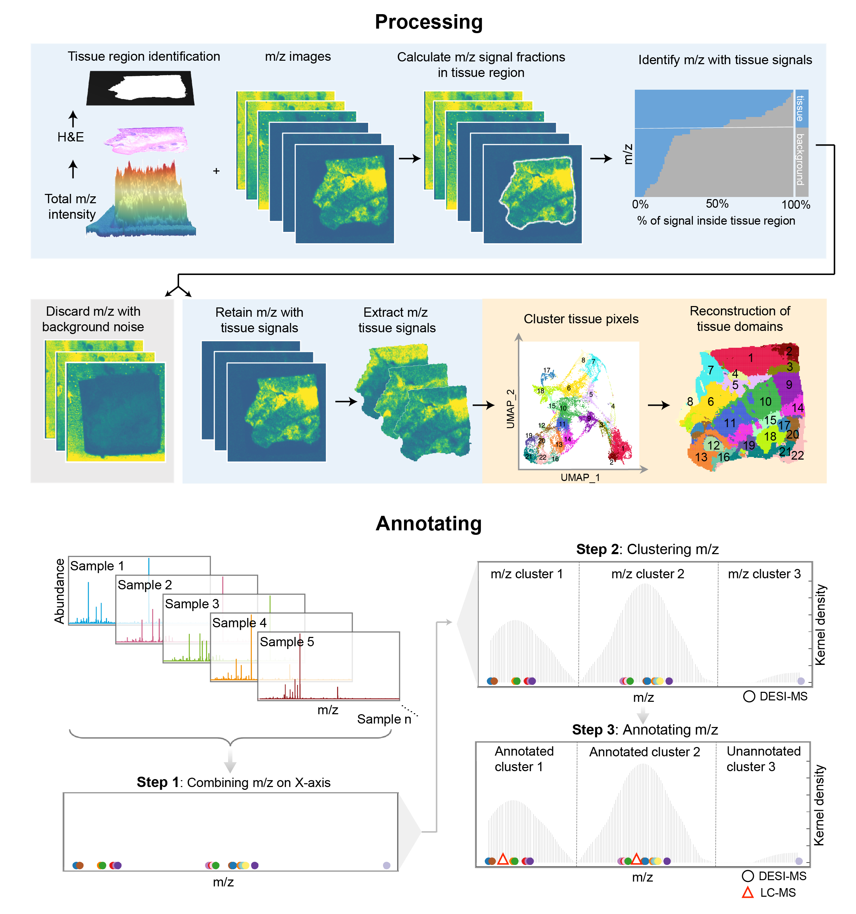

# CONTINUED: Cluster, integration and annotation of *In situ* metabonomics data

## Overview
`CONTINUED` is a algorithm to process *In situ* metabonomics data include reconstruction of histological spatial structure based on single sample clustering, integration of multiple samples and annotation with LC-MS data.

Using `CONTINUED` you can do:
* Processing  *In situ* metabonomics data which include tissue detection, remove noise signal and clustering.
* Annotating *In situ* metabonomics data utilize LC-MS data.
