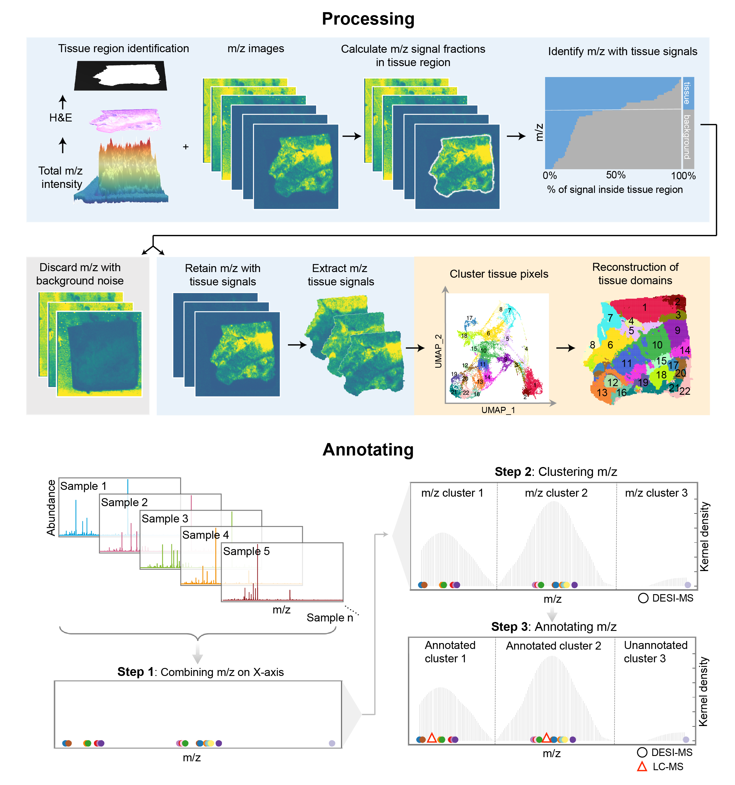

.. CONTINUED_document documentation master file, created by
   sphinx-quickstart on Sat Aug 31 00:29:38 2024.
   You can adapt this file completely to your liking, but it should at least
   contain the root `toctree` directive.

CONTINUED: Cluster, integration and annotation of *In situ* metabonomics data
================================
**CONTINUED** is a algorithm to process *In situ* metabonomics data include reconstruction of histological spatial structure based on single sample clustering, integration of multiple samples and annotation with LC-MS data.

Using `CONTINUED` you can do:
* Processing  *In situ* metabonomics data which include tissue detection, remove noise signal and clustering.
* Annotating *In situ* metabonomics data utilize LC-MS data.

.. toctree::
   :maxdepth: 1
   :caption: Contents:

   Installation
   Tutorial1 Processing
   Tutorial2 Annotating

===================================
